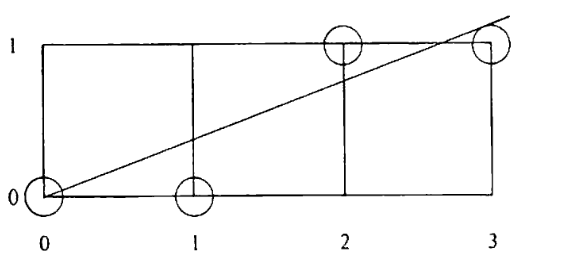
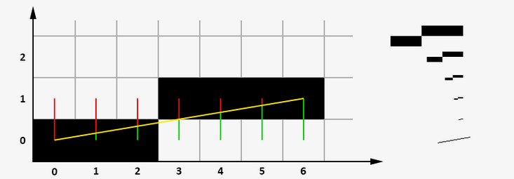
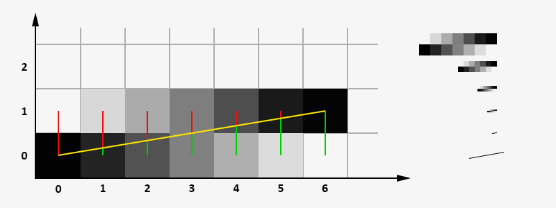

# Теоретические вопросы. (не все)

## 1. Что такое разложение отрезка в растр?

Это процесс определения пикселей, наилучшим образом _аппроксимирующих_ заданный отрезок.

## 2. Что такое ошибка?
Ошибка - расстояние между действительным положением отрезка и ближайшими координатами сетки.

Более наглядный пример:

Здесь значение ошибки выделено зеленым цветом.

## 3. Алгоритм Брезенхема с устранением ступенчатости.

### 3.1 Когда используется?
Используется при отображении рёбер многоугольника, который закрашивается. 
### 3.2 В чем идея?
Идея состоит в сглаживании резких переходов от ступени к ступени. 
### 3.3 На чем основывается сглаживание?
Сглаживание основывается на том, что каждый пиксель высвечивается со своим уровнем интенсивности. Уровень выбирается пропорционально площади части пикселя. **1 пиксель – квадрат с единичной стороной, а не математическая точка**

### 3.4 Ошибка в алгоритме со сглаживанием.
Ошибка — это мера площади той части пикселя, которая находится под отрезком.

## 4. Алгоритм Ву.
Он отличается тем, что на каждом шаге ведётся расчёт для двух ближайших к прямой пикселей, и они закрашиваются с разной интенсивностью, в зависимости от удаленности. Точное пересечение середины пикселя даёт 100% интенсивности, если пиксель находится на расстоянии в 0.9 пикселя, то интенсивность будет 10%. Иными словами, сто процентов интенсивности делится между пикселями, которые ограничивают векторную линию с двух сторон.

